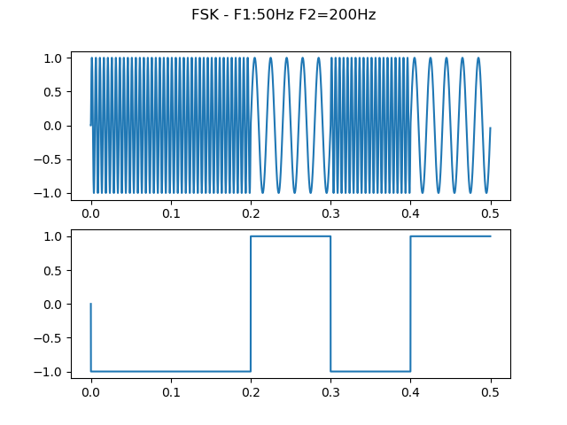

## Digital FSK Modulation
FSK (*frequency-shift keying*) modulation is a form of Passband modulation in witch digital information is transmitted through frequency changes of a carrier signal. The simplest FSK is binary FSK (BFSK). BFSK uses a pair of discrete frequencies to transmit binary (0s and 1s) information. With this scheme, the "1" is called the mark frequency and the "0" is called the space frequency.

This type of modulation is commonly used for transmissions in Radio Frequency Band, but FSK also alows us to implement it in low frequencies for a carrier with a low efficiency loss. This makes digital transmition through channels normally utilized to transmit voice possible. On top of that it also presents a versatile communication protocol in situations in which transmitting through radio waves or optical fibre is not an option or possibility
This type of modulation is commonly used for transmissions in Radio Frequency Band, but FSK also alows us to implement it in low frequencies for a carrier with a low efficiency loss. This makes digital transmission through channels normally utilized to transmit voice possible. On top of that it also presents a versatile communication protocol in situations in which transmitting through radio waves or optical fibre is not an option or possibility

## Syncronism
The message which shall be transmitted is asynchronous. Therefore, the moment at which the actual message begins is unknown, which implies that the detector must be designed to identify correctly the start and end point of the message within the transmition. For this to be possible, every message will be transmitted with a pre-defined bit sequence concatenated before the message to indicate where to begin the decoding process. This sequence we will call the "header" of the message and can be found in the file *header.txt*. Let it be known that this sequence was generated using a "*maximum lenght sequence*" algorithm, which increases the definition of the autocorrelation.
The message which shall be transmitted is asynchronous. Therefore, the moment at which the actual message begins is unknown, which implies that the detector must be designed to identify correctly the start and end point of the message within the transmission. For this to be possible, every message will be transmitted with a pre-defined bit sequence concatenated before the message to indicate where to begin the decoding process. This sequence we will call the "header" of the message and can be found in the file *header.txt*. Let it be known that this sequence was generated using a "*maximum lenght sequence*" algorithm, which increases the definition of the autocorrelation.

## Data Format
The data transmitted may be of different kinds (audio, text, image, etc..) and of varied sizes. The program is designed to be able to detect the bits and feed them **(without the header)** to the *app_decoder* function. This function accepts a binary array and returns the number of bits lost in the detection process. Attention should be directed towards the fact that the input of *app_decoder* is in fact an array of int. Also, let it be stated that it is paramount that the correct first position of message be identified, for an error in synchronism will reduce the acurracy to aproximately 50%.
@@ -24,7 +24,7 @@ Two different modulations can be processed: BFSK (2-FSK) and 4-FSK. Knowing whic
    - 1000 Hz - 11
    - 1200 Hz - 10
Although other detection methods exist and can be applied in this case, in this project we use a **Matched Filter**
For further information on how the transmition works, see *TX_script.py* and other files in *Examples* folder.
For further information on how the transmission works, see *TX_script.py* and other files in *Examples* folder.

## Symbol Rate
The symbol rate used may be defined moments before transmitting. Therefore, the detector presents the option of defining the rate at the beginning of the decoding process.
